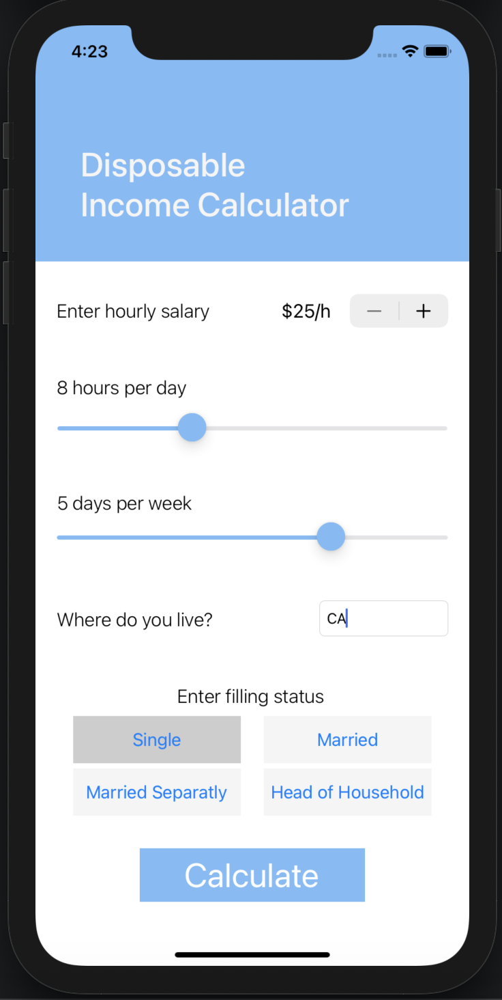
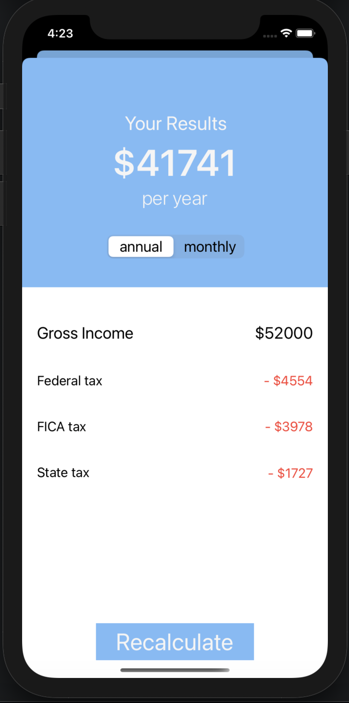

# Disposable Income Calculator


> Understanding taxes just got that much easier.

---

### Table of Contents

- [Description](#description)
- [How To Use](#how-to-use)
- [References](#references)
- [License](#license)
- [Author Info](#author-info)

---

## Description

Disposable Income Calcuator provides details on your taxes (Federal, FICA, & State) based on your income, location, and filling status, and also provides your disposable income, or how much money you take home post taxes.

### Motivation

As a young adult, there are many things about the real world I have to learn; one major such topic is money and finances. I’ve always known that working earns you money, but I only recently learned how taxes work. Upon further investigation, I was surprised to see just how much money the government taxes people. This got me curious, how much money do I actually take home? How much money do I really make each month/year? How should I budget?

#### Technologies

- Swift
- UIKit
- RESTFUL API

[Back To The Top](#read-me-template)

---

## How To Use

#### Installation

No additional installations required, simply print this command onto your terminal.
```
  git clone https://github.com/Aldo10012/disposable-income-calculator.git
```

#### API Reference

In order to make successful API call, you must first signup to [RapidAPI](https://rapidapi.com/stylinandy/api/taxee/) and [Taxee](https://taxee.io/) and use your own personal API keys.

### Screeneshots





[Back To The Top](#read-me-template)

---

